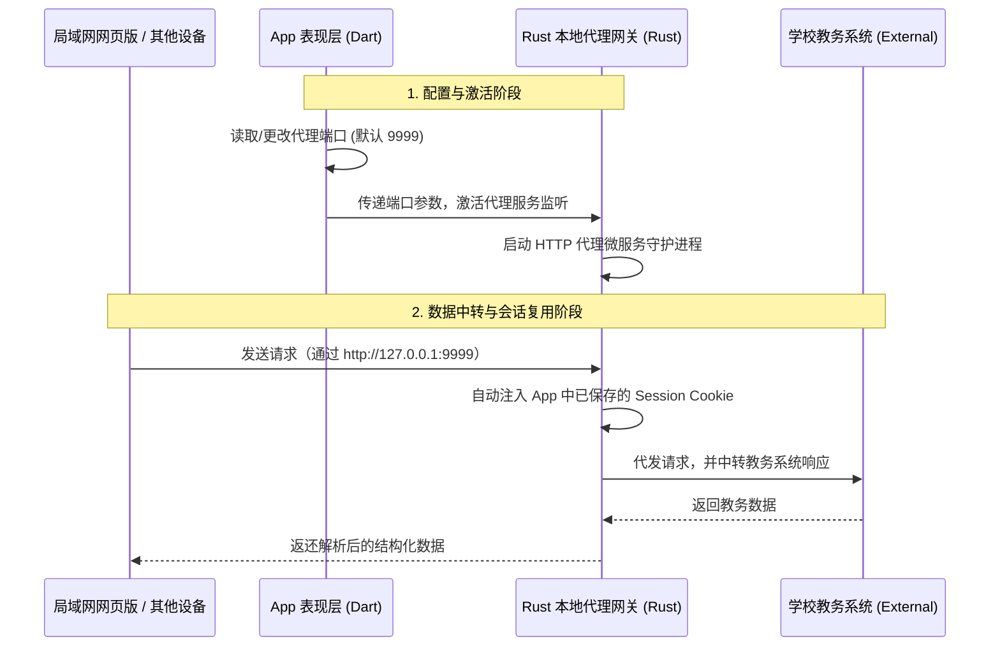

# 🍐 课表工程：整体开发与架构手册

本手册旨在为开发者提供关于本跨平台课表工程的全局架构解读、核心技术设计理念以及完整的业务开发与迭代生命周期说明。

---

## 🚀 一、 项目定位与技术亮点

本工程是一款**轻盈、优雅且功能完备的跨平台课表应用**，不仅提供了直观精美的多维日历视图，还深度整合了教务同步、空闲教室查询、学期成绩管理和考试倒计时等高频学生工具。

项目在技术架构上具备以下三大核心亮点：
1. **Flutter & Rust 双引擎驱动**：采用 **Flutter** 作为主 UI 框架确保多端的视觉表现力与流畅交互，底层使用 **Rust** 进行教务爬虫、OCR 验证码离线识别、本地代理服务等逻辑的编写，通过 `flutter_rust_bridge` (v2) 进行自动内存管理和高效的跨语言二进制数据通信。
2. **声明式状态管理体系**：全面采用最新的 **Riverpod 3.x** 注解生成模式（搭配 `riverpod_generator`），结合控制器模式（Controller-State Pattern）将业务数据处理与渲染层彻底解耦，结构清晰、维护成本极低。
3. **本地安全代理共享（Session Sharing）**：项目内置创新的局域网“本地代理网关”技术。App 在移动端成功登录教务系统后，会在底层（Rust 端）运行一个轻量级的代理微服务，网页端或其他局域网设备通过此代理网关访问教务处时，能够自动共享 App 已经过 OCR 和安全校验的登录 Session，免去重复登录和滑块验证的繁琐痛点。

---

## 📂 二、 目录结构与架构职责

项目采用典型的 **领域驱动设计（DDD）** 思想和 **干净架构（Clean Architecture）** 实现，按业务功能（Features）划分子模块，代码职责极其分明：

```text
li_curriculum_table/
├── lib/
│   ├── app/                      # 全局应用入口、统筹级组件与全局配置
│   ├── core/                     # 全局共享的底层核心服务与配置
│   │   ├── presentation/         # 全局通用组件（如更新对话框）
│   │   ├── rust/                 # 由 flutter_rust_bridge 自动生成的 Rust 绑定 Dart 接口
│   │   ├── services/             # 升级服务、OCR 引擎后台初始化等服务
│   │   └── settings/             # 系统全局配置（含代理配置、课表滑动模式等）的领域模型与持久化
│   ├── features/                 # 业务功能特性模块（高内聚，低耦合）
│   │   ├── timetable/            # 课表主模块（含日历视图、周推算基准、OCR数据提取）
│   │   ├── classroom/            # 空闲教室模块
│   │   ├── grades/               # 成绩同步与成绩单卡片模块
│   │   ├── exam_schedule/        # 考试安排与倒计时模块
│   │   ├── settings/             # 设置页面 Tab 交互与控制器联动
│   │   └── navigation/           # 全局导航栏控制与多端自适应布局
│   ├── util/                     # 通用帮助类（设备检测、用户反馈处理等）
│   └── main.dart                 # 应用启动主入口（多引擎初始化与容器绑定）
├── rust/                         # 底层 Rust 源代码目录
│   ├── src/                      # Rust 核心库实现（包含爬虫、OCR、代理服务器）
│   └── Cargo.toml                # Rust 依赖声明
├── rust_builder/                 # 由 flutter_rust_bridge 自动生成的 Rust 构建脚本与胶水库
├── pubspec.yaml                  # Flutter 依赖配置
└── .fvmrc                        # FVM 规范的 Flutter SDK 版本控制文件（指定 beta 渠道）
```

---

## 🛠️ 三、 整体开发与迭代流程

本工程的完整研发流程遵循敏捷开发与规范化的技术选型，整体生命周期如下：

### 1. 环境搭建与版本约束
为了规避多端平台（如 Windows C++ 编译器、Android NDK、Rust 编译器）的构建冲突，项目开发前需统一配置好如下工具链：
- **FVM (Flutter Version Management)**：约束项目的 Flutter SDK 使用特定的 `beta` 渠道版本。
- **Rustup & Cargo**：安装 Rust 编译工具，并通过 Cargo 依赖管理管理 Rust 底层的 `reqwest`、`tokio` 等库。
- **flutter_rust_bridge_codegen**：安装全局的桥接代码生成工具，实现命令一键同步 Dart 与 Rust 接口。

### 2. 精美动态 UI 设计（UI/UX 体系）
- 界面风格基于 **Material 3** 规范，采用 `flex_color_scheme` 管理主题，支持全局主题色智能提取与系统级**深色模式（Dark Mode）**自适应切换。
- 在桌面端通过 `window_manager` 进行窗口尺寸预设并隐藏系统默认的标题栏，使用自定义的 `TitleBar` 呈现精美无边框视觉效果。
- 广泛融入交互动画、水波纹及微动气泡 SnackBar，创造直观而高级的用户触感。

### 3. 底层 Rust 服务与爬虫开发
- **教务系统爬取**：在 `rust/` 目录下，利用 `reqwest` 与 `scraper` 库编写高性能的模拟登录与数据抓取逻辑。
- **图片验证码识别**：嵌入轻量级图片处理与字符匹配网络，实现离线 OCR 模块，规避了第三方收费 API 的依赖。
- **桥接代码生成**：开发期间一旦 Rust 接口签名发生修改，运行以下命令即可由 FRB 工具链自动在 `lib/core/rust/` 中生成类型安全的 Dart 接口：
  ```bash
  flutter_rust_bridge_codegen generate
  ```

### 4. 领域层状态管理 (Riverpod Annotation)
- 在各业务子模块的 `domain/` 下设计好数据模型（使用 `freezed` 与 `json_annotation` 自动生成 Immutable 属性和 JSON 反序列化代码）。
- 在 `presentation/state/` 下使用 `@riverpod` 声明控制器。例如 `TimetableController`：
  ```dart
  @riverpod
  class TimetableController extends _$TimetableController {
    @override
    TimetableState build() => initialTimetableState;
    // 定义核心业务方法，如 syncFromCache() / setTermStartDate()
  }
  ```
- 任何状态改动发生后，通过控制器的 `state = state.copyWith(...)` 触发 UI 层的 `ref.watch` 响应式自动局部重绘，兼顾了完美的执行性能与开发效率。

### 5. 存储持久化与离线支持
- 所有敏感凭证（如教务密码）及全局配置，必须统一接入核心安全存储 `SecureStorageStore`。
- 首屏加载采用“离线缓存优先”设计：启动时先并发读取本地缓存，渲染出历史课表以秒级展示页面，并在后台异步请求教务同步，大幅提高首屏加载体验。

### 6. 多端适配与发版校验
- **多端响应式布局**：通过 `LayoutBuilder` 和设备检测机制动态计算组件排布。例如，在平板或电脑上扩展课表列宽，而在手机端则优化滚动舒适度。
- **桌面端适配**：利用 `window_manager` 处理窗口聚焦、窗口拖拽边界与最小化。
- **打包分发**：使用 `msix` 配置文件方便生成 Windows 安装包，并利用 `flutter_launcher_icons` 统一多平台应用 Icon 图标。

---

## 🛰️ 四、 增强功能：“本地代理网关”技术方案

本地代理网关是本工程的一大技术创新，专门解决**跨设备同步与网页端免去繁琐教务处验证**的痛点。

### 🔄 通信逻辑与运行机制


1. **统一的系统设置**：用户在设置 Tab 或网页控制台配置代理端口。
2. **Dart 触发管理**：`SettingsController` 的 `_syncWithRust` 会向 Rust 底层调用 `runProxyServer`，将端口等配置传入。
3. **Rust 多线程微服务**：底层基于 Rust 的多线程网络框架启动轻量级网关，自动中转所有教务处请求，并负责实时管理与刷新登录 Cookie。

---

## 📝 五、 新功能开发规范与改动范式

当开发者需要为项目引入新特性时，请严格遵守以下开发范式（以本次新增的 **“按星期滑动 (weeklyScroll)”** 功能为例）：

1. **领域模型扩展**：
   在 `lib/core/settings/domain/settings_repository.dart` 的 `AppSettings` 中新增属性，保证属性不可变（immutable），并提供 `copyWith` 和默认工厂方法。
2. **持久化逻辑更新**：
   在 `lib/core/settings/data/settings_repository_impl.dart` 中，将新增属性序列化为字符串写入持久化层，并处理旧版本无该键名时的平滑兼容。
3. **控制层暴露修改方法**：
   在 `lib/core/settings/presentation/settings_providers.dart` 里的控制器类新增对应的赋值操作，在更改 `state` 后异步保存至本地。
4. **UI 层声明式监听**：
   在表现层组件（如日历容器 `TimetableWeekView`）中通过 `ref.watch(settingsControllerProvider).attribute` 响应配置变化。在此处，我们动态将组件的 `horizontalScrollPhysics` 属性绑定为 `weeklyScroll ? const PageScrollPhysics() : null`，从而不修改其核心滑动逻辑的情况下，轻量且优雅地实现了无极滑动和整周滑动的动态切换。
5. **代码运行与构建生成**：
   如果涉及 `@riverpod` 或 `@freezed` 等代码生成类的改动，需要在控制台运行代码生成指令：
   ```bash
   dart run build_runner build --delete-conflicting-outputs
   ```

本工程旨在以最优雅的代码结构展现最卓越的跨平台开发实践。遵循本开发流规范，您将能够非常流畅、敏捷地为本应用贡献出更多令人惊叹的新特性！
