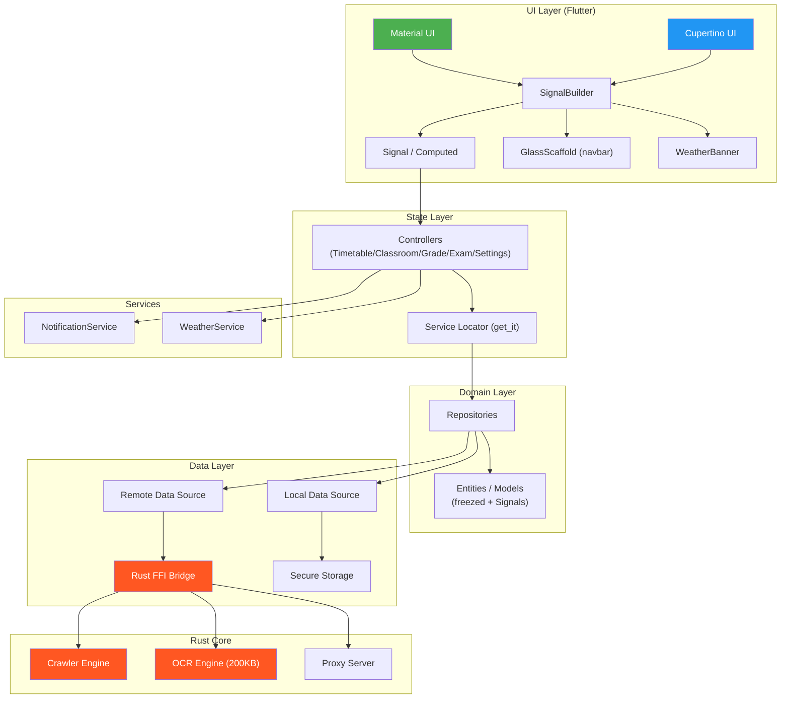
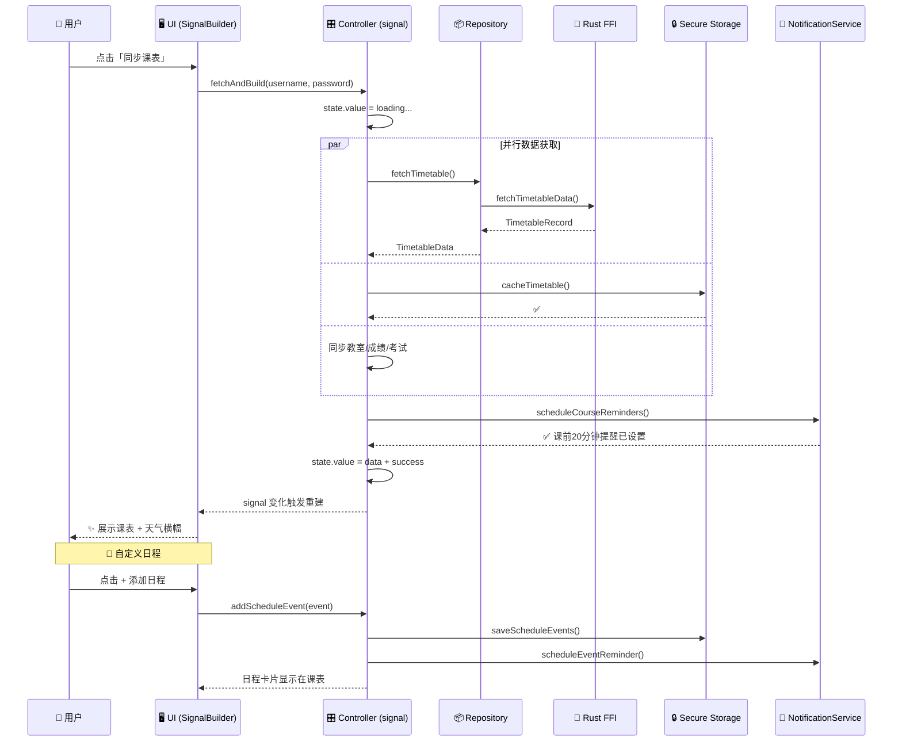
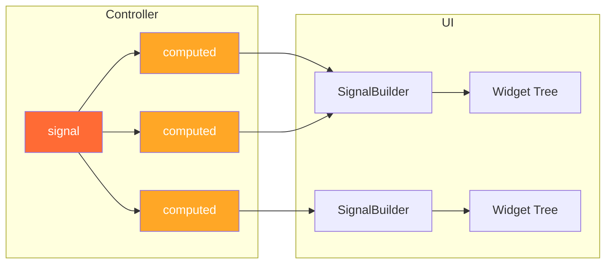
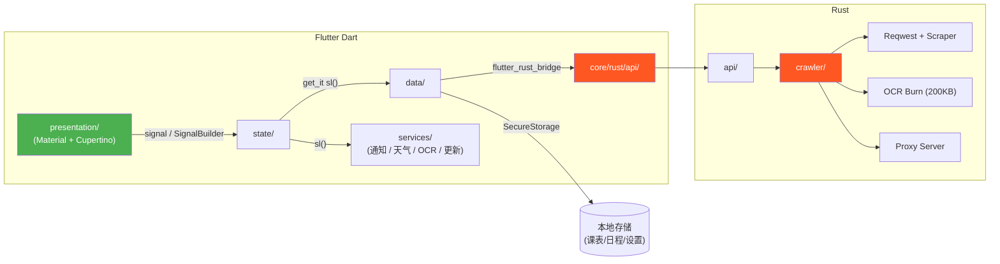
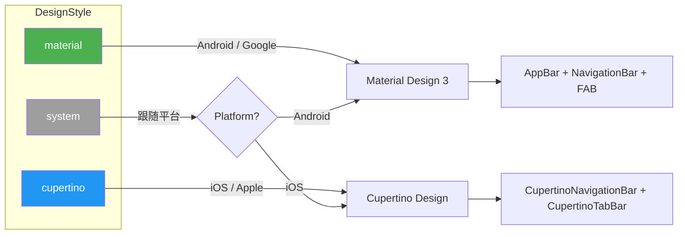
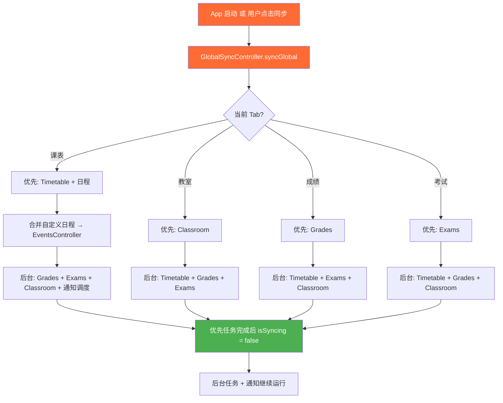

# 🍐 课表

[](https://flutter.dev)
[](https://www.rust-lang.org)
[](https://pub.dev/packages/signals)
[](LICENSE)

> 一款轻盈、优雅且高性能的跨平台课表应用。


---

## ✨ 特性亮点

| 特性 | 说明 |
|------|------|
| 🚀 **Rust 驱动核心** | 采用 `flutter_rust_bridge` 将抓取逻辑与 OCR 引擎下沉至 Rust 层，响应丝滑 |
| 🧠 **自研 OCR** | 基于 Burn 框架的自研 OCR 模型，仅 200KB，本地识别验证码，无需联网 |
| 🎨 **双设计风格** | Material Design 3 + Apple Cupertino，运行时一键切换 |
| 🌈 **动态取色** | 支持根据系统壁纸动态调整 UI 配色（Android 12+） |
| 🔐 **隐私至上** | 所有数据本地存储，敏感信息通过 `flutter_secure_storage` 硬件级加密 |
| 🌐 **全平台** | Android / iOS / Windows / macOS / Linux / Web 六端覆盖 |
| 📡 **本地代理** | Web 端通过跨进程本地网关解决跨域抓取难题 |
| 📅 **自定义日程** | 支持添加一次性日程到课表，支持当天定时通知提醒，长按即可删除 |
| 🔔 **智能通知** | 课前 20 分钟、考前 1 天 + 2 小时、成绩发布等多场景提醒 |
| ☁️ **天气横幅** | 课表顶部展示当日天气信息，一目了然 |
| 📖 **图书封面** | 图书馆检索支持自动获取豆瓣图书封面（可开关） |

---

## 🏗️ 系统架构

### 整体分层



### 数据流



### 状态管理 (signals)



### 依赖注入 (get_it)

```mermaid
graph TB
    subgraph "Service Locator"
        SL[get_it]
    end

    subgraph "Singletons"
        SL --> SS[SecureStorageStore]
        SL --> TC[TimetableCrawlerClient]
        SL --> CC[ClassroomRepository]
        SL --> GR[GradeRepository]
        SL --> ER[ExamRepository]
        SL --> SE[ScheduleEventsRepository]
        SL --> NS[NotificationService]
        SL --> WS[WeatherService]
    end

    subgraph "Controllers"
        SL --> NC[NavigationController]
        SL --> SC[SettingsController]
        SL --> TT[TimetableController]
        SL --> CT[ClassroomController]
        SL --> GC[GradeController]
        SL --> EC[ExamController]
        SL --> GS[GlobalSyncController]
    end

    TT --> SL
    CT --> SL
    GC --> SL
    EC --> SL

    style SL fill:#9C27B0,color:#fff
```



---

## 📂 项目结构

### Flutter (`lib/`)

```text
lib/
├── main.dart                                    # 应用入口
├── app/
│   └── app.dart                                 # MaterialApp 配置 + 双风格主题
├── core/
│   ├── di/
│   │   └── service_locator.dart                 # get_it 依赖注入 (30+ 注册)
│   ├── presentation/
│   │   ├── adaptive_style.dart                  # DesignStyle 枚举 + 运行时切换
│   │   ├── adaptive_icons.dart                  # 自适应图标 (Material ↔ Cupertino)
│   │   ├── adaptive_helpers.dart                # 通用工具 (对话框/消息/加载指示器)
│   │   ├── adaptive_widgets.dart                # 自适应组件 (NavigationBar/Dialog)
│   │   ├── update_dialog.dart                   # 更新提示 (Material + Cupertino 双版本)
│   │   ├── glass_scaffold.dart                  # 毛玻璃导航栏容器 (card 已退化为实色)
│   │   └── glass_dialog.dart                    # 毛玻璃弹窗容器
│   ├── rust/                                    # flutter_rust_bridge 生成代码
│   │   ├── api/                                 # Rust → Dart 接口
│   │   │   ├── auth.dart                        # 登录认证
│   │   │   ├── crawler.dart                     # 课表爬虫 + 代理服务器
│   │   │   ├── classroom.dart                   # 教室查询
│   │   │   ├── grade.dart                       # 成绩查询
│   │   │   ├── exam.dart                        # 考试查询
│   │   │   └── book.dart                        # 图书查询
│   │   └── crawler/
│   │       └── model.dart                       # Rust 共享数据模型
│   ├── services/
│   │   ├── notification_service.dart            # 本地通知 (课程/考试/日程提醒)
│   │   ├── weather_service.dart                 # 天气查询服务
│   │   ├── ocr_initializer.dart                 # OCR 引擎初始化 (signal)
│   │   └── update_service.dart                  # GitHub Release 更新检查 (Dio)
│   └── settings/
│       ├── domain/
│       │   └── settings_repository.dart         # AppSettings 实体 + Repository 接口
│       ├── data/
│       │   └── settings_repository_impl.dart    # Repository 实现 (SecureStorage)
│       └── presentation/
│           └── settings_providers.dart           # SettingsController (signal + computed)
├── features/
│   ├── navigation/
│   │   └── presentation/
│   │       ├── pages/
│   │       │   └── main_screen.dart             # 主屏幕 (PageView + 底部导航)
│   │       └── state/
│   │           ├── navigation_controller.dart   # Tab 索引 (signal)
│   │           └── global_sync_controller.dart  # 全局同步调度 (signal)
│   │
│   ├── timetable/                               # 📅 课表
│   │   ├── domain/
│   │   │   ├── entities/
│   │   │   │   ├── course_row.dart              # 课表行 (freezed)
│   │   │   │   ├── course_occurrence.dart       # 课程实例 (freezed)
│   │   │   │   ├── timetable_data.dart          # 课表数据 (freezed)
│   │   │   │   ├── cached_timetable.dart        # 缓存课表
│   │   │   │   ├── login_credentials.dart       # 登录凭据 (freezed)
│   │   │   │   ├── teaching_week_baseline.dart  # 教学周基准 (freezed)
│   │   │   │   ├── time_slot.dart               # 时间段 (freezed)
│   │   │   │   └── schedule_event.dart          # 自定义日程 (freezed)
│   │   │   ├── repositories/                    # 抽象接口
│   │   │   └── services/
│   │   │       ├── course_mapper.dart           # Rust → Domain 映射
│   │   │       ├── teaching_week_scheduler.dart # 教学周计算
│   │   │       ├── teaching_week_inference.dart # 教学周推断
│   │   │       ├── section_range_utils.dart     # 节次范围工具
│   │   │       └── section_time_mapping.dart    # 节次时间映射
│   │   ├── data/
│   │   │   ├── datasources/
│   │   │   │   ├── secure_storage_store.dart    # 批量安全存储封装
│   │   │   │   ├── secure_credentials_local_datasource.dart
│   │   │   │   ├── secure_timetable_local_datasource.dart
│   │   │   │   ├── secure_teaching_week_baseline_local_datasource.dart
│   │   │   │   ├── secure_schedule_events_local_datasource.dart
│   │   │   │   └── timetable_crawler_client.dart # Rust 爬虫客户端
│   │   │   └── repositories/                    # 接口实现
│   │   └── presentation/
│   │       ├── state/
│   │       │   ├── timetable_controller.dart    # 课表控制器 (signal)
│   │       │   └── timetable_state.dart         # 课表状态 (freezed)
│   │       ├── bar/
│   │       │   └── title_bar.dart               # 桌面端标题栏
│   │       ├── calendar_view/
│   │       │   ├── calendar_view_adapter.dart   # EventsController 适配 (effect)
│   │       │   ├── timetable_week_view.dart     # 周视图组件
│   │       │   └── timetable_week_view_components.dart
│   │       └── pages/
│   │           ├── tabs/
│   │           │   └── timetable_tab.dart       # 课表 Tab 入口
│   │           └── widgets/
│   │               ├── timetable_appointment_card.dart       # 课程卡片 (Material)
│   │               ├── timetable_appointment_cupertino.dart  # 课程卡片 (Cupertino)
│   │               ├── timetable_page_sections.dart          # 登录面板 + 状态横幅
│   │               ├── add_schedule_event_sheet.dart         # 添加日程弹窗
│   │               ├── weather_banner.dart                  # 天气横幅
│   │               └── timetable_ruler_components.dart       # 时间标尺
│   │
│   ├── classroom/                               # 🏫 空闲教室
│   │   ├── domain/
│   │   │   ├── models/
│   │   │   │   ├── campus.dart                  # 校区 (freezed)
│   │   │   │   ├── building.dart                # 教学楼 (freezed)
│   │   │   │   ├── classroom_availability.dart  # 教室可用性 (freezed)
│   │   │   │   └── classroom_schedule.dart      # 教室课表 (freezed)
│   │   │   └── repositories/
│   │   ├── data/
│   │   │   ├── datasources/
│   │   │   │   ├── classroom_remote_datasource.dart
│   │   │   │   └── secure_classroom_local_datasource.dart
│   │   │   └── repositories/
│   │   └── presentation/
│   │       ├── state/
│   │       │   ├── classroom_controller.dart    # 教室控制器 (signal)
│   │       │   └── classroom_state.dart         # 教室状态 (freezed)
│   │       └── pages/
│   │           ├── classroom_tab.dart           # 教室 Tab 入口 + Material
│   │           ├── classroom_cupertino.dart     # Cupertino 教室 UI
│   │           └── classroom_widgets.dart       # 共享组件 (11 个)
│   │
│   ├── grades/                                  # 📊 成绩
│   │   ├── domain/
│   │   │   ├── models/grade.dart
│   │   │   └── repositories/
│   │   ├── data/
│   │   │   ├── datasources/
│   │   │   │   ├── grade_remote_datasource.dart
│   │   │   │   └── grade_local_datasource.dart
│   │   │   └── repositories/
│   │   └── presentation/
│   │       ├── state/
│   │       │   ├── grade_controller.dart        # 成绩控制器 (signal)
│   │       │   └── grade_state.dart
│   │       └── pages/
│   │           ├── grades_tab.dart              # 成绩 Tab 入口 + Material
│   │           └── grades_cupertino.dart        # Cupertino 成绩 UI
│   │
│   ├── exam_schedule/                           # 📝 考试
│   │   ├── domain/
│   │   │   ├── models/exam.dart
│   │   │   └── repositories/
│   │   ├── data/
│   │   │   ├── datasources/
│   │   │   │   ├── exam_remote_datasource.dart
│   │   │   │   └── exam_local_datasource.dart
│   │   │   └── repositories/
│   │   └── presentation/
│   │       ├── state/
│   │       │   ├── exam_controller.dart         # 考试控制器 (signal)
│   │       │   └── exam_state.dart
│   │       └── pages/
│   │           ├── exam_schedule_tab.dart        # 考试 Tab 入口 + Material
│   │           └── exam_schedule_cupertino.dart  # Cupertino 考试 UI
│   │
│   ├── book/                                    # 📚 图书
│   │   └── presentation/pages/
│   │       ├── book_tab.dart                    # 图书 Tab 入口 + 状态管理
│   │       ├── book_material.dart               # Material 图书 UI
│   │       └── book_cupertino.dart              # Cupertino 图书 UI
│   │
│   └── settings/                                # ⚙️ 设置 (主题/学期/交互/高级)
│       └── presentation/pages/tabs/
│           ├── settings_tab.dart                # 设置 Tab 入口 + 状态管理
│           ├── settings_sections.dart           # 共享 Section 组件 (5 个)
│           └── settings_cupertino.dart          # Cupertino 设置 UI
│
└── util/
    ├── util.dart                                # 平台检测 (isDesktop / isWeb)
    └── feedback_handler.dart                    # 用户反馈截图处理
```

### Rust (`rust/`)

```text
rust/
├── Cargo.toml                                   # Rust 依赖配置
└── src/
    ├── lib.rs                                   # Crate 入口
    ├── frb_generated.rs                         # flutter_rust_bridge 生成代码
    ├── ocr.rs                                   # OCR 引擎入口 (Burn 模型)
    ├── api/                                     # 暴露给 Dart 的接口
    │   ├── mod.rs
    │   ├── auth.rs                              # 登录认证
    │   ├── crawler.rs                           # 课表爬取 + 代理服务器控制
    │   ├── classroom.rs                         # 教室查询
    │   ├── grade.rs                             # 成绩查询
    │   ├── exam.rs                              # 考试查询
    │   ├── book.rs                              # 图书查询
    │   └── simple.rs                            # 简单测试接口
    ├── crawler/                                 # 爬虫引擎核心
    │   ├── mod.rs
    │   ├── error.rs                             # 错误类型定义
    │   ├── model.rs                             # 共享数据模型 (Dart ↔ Rust)
    │   ├── parser.rs                            # HTML 解析器
    │   └── core/
    │       ├── mod.rs
    │       ├── session.rs                       # HTTP 会话管理 (Reqwest + Cookie)
    │       └── proxy_server.rs                  # 本地代理服务器 (Web 端跨域方案)
    └── model/
        └── mod.rs                               # 通用模型定义
```

### 架构分层对照




## 🎨 双设计风格



运行时切换设计风格，所有 UI 组件自动适配：

| 组件 | Material | Cupertino |
|------|----------|-----------|
| 导航栏 | `NavigationBar` | `CupertinoTabBar` |
| 页面头 | `AppBar (AppBarM3E)` | `GlassScaffold` (毛玻璃导航栏) |
| 课程卡片 | `Card` + 阴影 | `Container` + 圆角实色 |
| 日程添加 | `FilledButton` (FAB) | `CupertinoButton` (导航栏 +) |
| 列表 | `ListView` + `Card` | `ListView` + `_iosCard` |
| 对话框 | `AlertDialog` | `CupertinoAlertDialog` |
| 详情弹窗 | `showModalBottomSheet` | `CupertinoActionSheet` / `GlassDialog` |
| 选择器 | `SegmentedButton` | `CupertinoActionSheet` |
| 加载器 | `CircularProgressIndicator` | `CupertinoActivityIndicator` |
| 消息提示 | `SnackBar` (Adaptive) | `CupertinoAlertDialog` (自动消失) |

---

## 🔄 同步流程



---

## 🚀 开发上手

### 环境准备

```bash
fvm use master

rustup default nightly

cargo install flutter_rust_bridge_codegen
```

### 依赖安装

```bash
fvm flutter pub get
```

### 代码生成

```bash
# flutter_rust_bridge (修改 rust/ 接口后)
flutter_rust_bridge_codegen generate

# freezed + json_serializable (修改实体后)
fvm dart run build_runner build --delete-conflicting-outputs
```

### 运行

```bash
# 移动端 / 桌面端
fvm flutter run

# Web 端
fvm flutter run -d chrome

# 指定设备
fvm flutter run -d windows
fvm flutter run -d macos
```

### 构建发布

```bash
# Android APK
fvm flutter build apk --release

# Windows MSIX
fvm flutter build windows --release

# macOS
fvm flutter build macos --release

# Web
fvm flutter build web --release
```

## ☘️ 参与贡献

我们欢迎任何形式的贡献！无论是提交 Issue 还是 Pull Request。

1. Fork 本仓库
2. 创建特性分支 (`git checkout -b feature/amazing-feature`)
3. 提交更改 (`git commit -m 'feat: add amazing feature'`)
4. 推送到分支 (`git push origin feature/amazing-feature`)
5. 创建 Pull Request

### Commit 规范

```
feat: 新功能
fix: 修复 Bug
refactor: 重构
perf: 性能优化
style: 代码风格
docs: 文档
chore: 构建/工具
```

---

> 愿这张课表，帮你把每一天都安排得从容好看。 🍐
