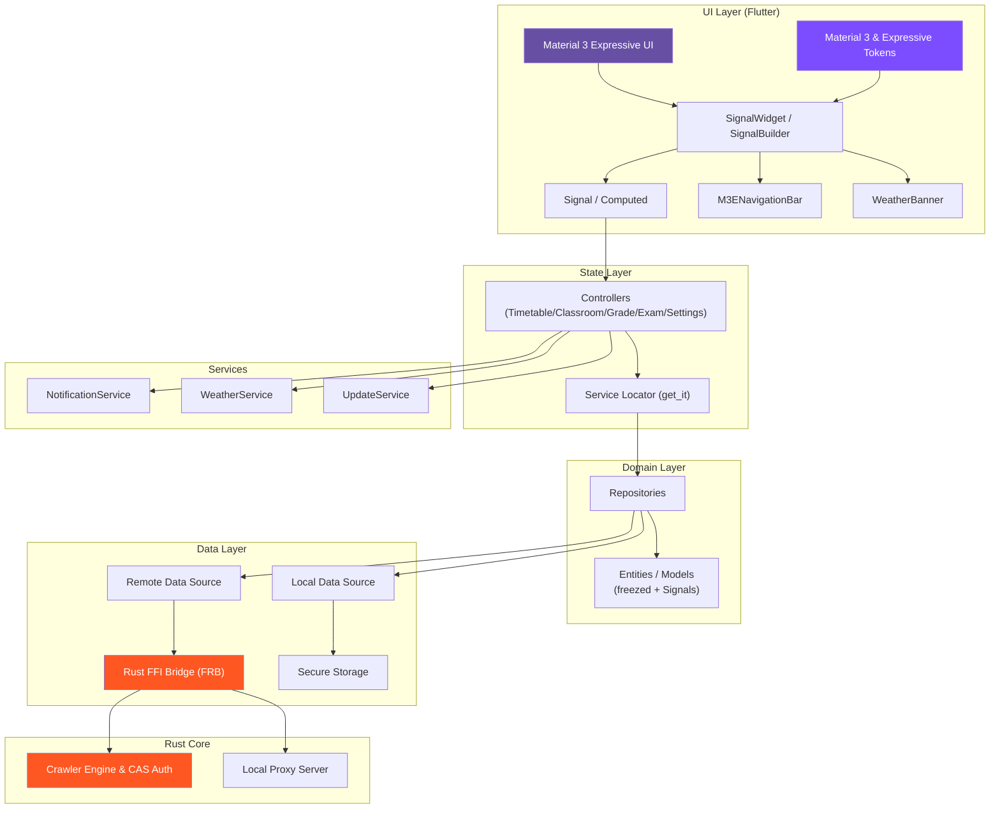
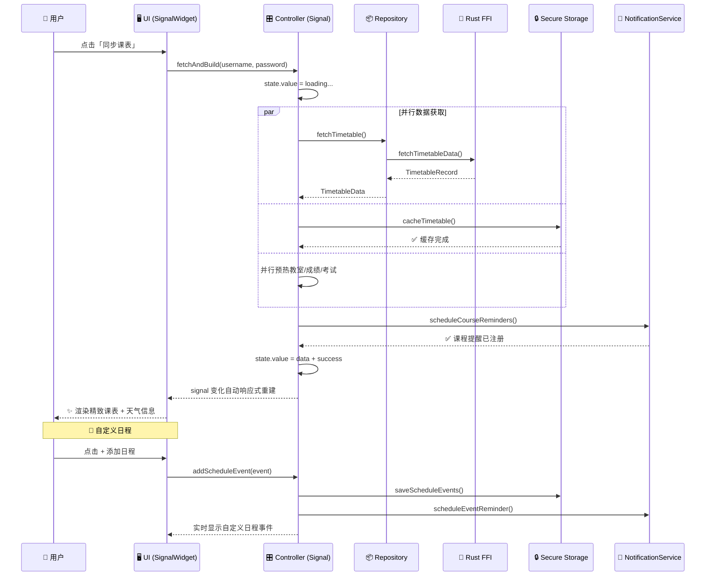
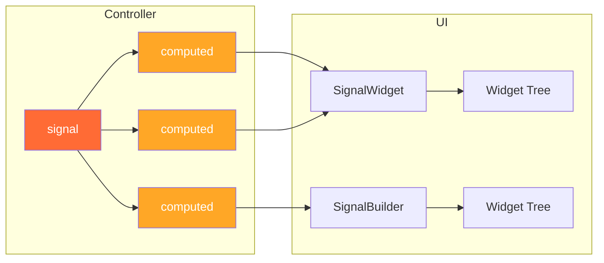
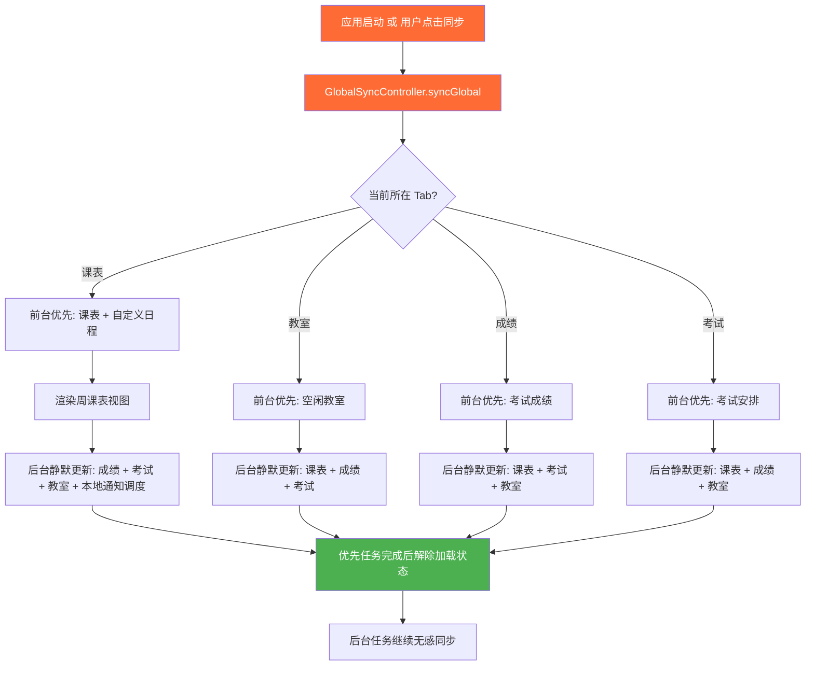

# 🍐 课表

[](https://flutter.dev)
[](https://www.rust-lang.org)
[](https://pub.dev/packages/signals)
[](https://m3.material.io)
[](LICENSE)

> 一款轻盈、优雅且高性能的跨平台课表与校园助手应用，全端统一采用 Material 3 Expressive 设计系统与纯 Rust 高效爬虫引擎构建。

---

## ✨ 特性亮点

| 特性 | 说明 |
|------|------|
| 🎨 **Material 3 Expressive** | 全面统一采用 Material 3 Expressive 设计语言，高质感动态配色与精致微动效 |
| 🔐 **原生 CAS 统一认证** | 基于 Rust 原生实现的 CAS 加密与会话管理，零模型依赖，毫秒级快速登录 |
| 🌈 **动态取色与主题系统** | 支持跟随系统壁纸动态取色 (`dynamic_color`)，内置多种丰富色调方案 (`flex_color_scheme`) |
| 🛡️ **隐私至上** | 所有数据均存放在本地，敏感凭证采用系统级硬件密钥库 (`flutter_secure_storage`) 严密加密 |
| 🌐 **跨平台支持** | 覆盖 Android / Windows / macOS / Linux / iOS / Web |
| 📡 **本地跨域代理** | Web 端支持通过跨进程本地网关透明解决教务跨域抓取痛点 |
| 📅 **自定义日程与异步课** | 支持在课表网格中穿插添加单次/周期自定义日程，顶部支持录播/网课折叠栏 |
| 🔔 **智能通知提醒** | 课程开课前 20 分钟提醒、考试日程前置提醒等多场景通知 |
| 📖 **图书馆检索** | 快速检索图书馆藏并自动匹配豆瓣图书封面与详细借阅状态 |

---

## 🏗️ 系统架构

### 整体分层


```mermaid
graph TB
    subgraph "UI Layer (Flutter)"
        A[Material 3 Expressive UI] --> C[SignalWidget / SignalBuilder]
        M3E[Material 3 & Expressive Tokens] --> C
        C --> D["Signal / Computed"]
        C --> Nav["M3ENavigationBar"]
        C --> We["WeatherBanner"]
    end

    subgraph "State Layer"
        D --> E["Controllers<br/>(Timetable/Classroom/Grade/Exam/Settings)"]
        E --> F["Service Locator (get_it)"]
    end

    subgraph "Domain Layer"
        F --> G["Repositories"]
        G --> H["Entities / Models<br/>(freezed + Signals)"]
    end

    subgraph "Data Layer"
        G --> I["Remote Data Source"]
        G --> J["Local Data Source"]
        I --> K["Rust FFI Bridge (FRB)"]
        J --> L["Secure Storage"]
    end

    subgraph "Rust Core"
        K --> M[Crawler Engine & CAS Auth]
        K --> O[Local Proxy Server]
    end

    subgraph "Services"
        E --> No["NotificationService"]
        E --> We2["WeatherService"]
        E --> Up["UpdateService"]
    end

    style A fill:#6750A4,color:#fff
    style M3E fill:#7C4DFF,color:#fff
    style K fill:#FF5722,color:#fff
    style M fill:#FF5722,color:#fff
```

### 数据流


```mermaid
sequenceDiagram
    participant U as 👤 用户
    participant UI as 🖥️ UI (SignalWidget)
    participant Ctrl as 🎛️ Controller (Signal)
    participant Repo as 📦 Repository
    participant Rust as 🦀 Rust FFI
    participant Storage as 🔒 Secure Storage
    participant Notif as 🔔 NotificationService

    U->>UI: 点击「同步课表」
    UI->>Ctrl: fetchAndBuild(username, password)
    Ctrl->>Ctrl: state.value = loading...

    par 并行数据获取
        Ctrl->>Repo: fetchTimetable()
        Repo->>Rust: fetchTimetableData()
        Rust-->>Repo: TimetableRecord
        Repo-->>Ctrl: TimetableData
    and
        Ctrl->>Storage: cacheTimetable()
        Storage-->>Ctrl: ✅ 缓存完成
    and
        Ctrl->>Ctrl: 并行预热教室/成绩/考试
    end

    Ctrl->>Notif: scheduleCourseReminders()
    Notif-->>Ctrl: ✅ 课程提醒已注册
    Ctrl->>Ctrl: state.value = data + success
    Ctrl-->>UI: signal 变化自动响应式重建
    UI-->>U: ✨ 渲染精致课表 + 天气信息

    Note over U,UI: 📅 自定义日程
    U->>UI: 点击 + 添加日程
    UI->>Ctrl: addScheduleEvent(event)
    Ctrl->>Storage: saveScheduleEvents()
    Ctrl->>Notif: scheduleEventReminder()
    Ctrl-->>UI: 实时显示自定义日程事件
```

### 状态管理 (Signals)


```mermaid
graph LR
    subgraph "Controller"
        A[signal] --> B[computed]
        A --> C[computed]
        A --> D[computed]
    end

    subgraph "UI"
        E[SignalWidget] --> F[Widget Tree]
        G[SignalBuilder] --> H[Widget Tree]
    end

    B --> E
    C --> G
    D --> E

    style A fill:#FF6B35,color:#fff
    style B fill:#FFA726,color:#fff
    style C fill:#FFA726,color:#fff
    style D fill:#FFA726,color:#fff
```

---

## 🎨 视觉与交互设计 (Material 3 Expressive)

本项目已全面统一至 Google **Material 3 Expressive** 设计体系：

- **动态取色与色调方案**：集成 `dynamic_color` 与 `flex_color_scheme`，提供 Tonal Spot、Vivid、Expressive、High Contrast 等多种色彩模式，在 Android 12+ 上完美契合系统壁纸风格。
- **现代化组件集**：
  - **底部导航**：全端统一的 `M3ENavigationBar`，搭配状态微交互动效。
  - **按钮与控件**：全面采用圆润且表现力丰富的 `M3EButton` 系列（Filled, Tonal, Outlined, Text）。
  - **课表视图**：基于 Material 3 色彩令牌自适应高亮当前周、当前星期与正在进行的课程（带呼吸灯 Badge）。
  - **弹窗与面板**：采用圆角底栏 Sheet（`showModalBottomSheet`）与自适应对话框，排版轻快明确。

---

## 📂 项目结构

### Flutter (`lib/`)

```text
lib/
├── main.dart                                    # 应用入口及服务定位器预热
├── app/
│   └── app.dart                                 # MaterialApp 配置 + M3EExpressive 主题绑定
├── core/
│   ├── di/
│   │   └── service_locator.dart                 # get_it 依赖注入服务中心
│   ├── presentation/
│   │   ├── adaptive_style.dart                  # 统一设计规范辅助
│   │   ├── adaptive_icons.dart                  # Material 3 统一矢量图标集
│   │   ├── adaptive_helpers.dart                # 对话框/提示/加载指示器通用工具
│   │   ├── update_dialog.dart                   # 版本更新提示对话框
│   │   ├── info_row.dart                        # 详情信息行通用展示组件
│   │   └── terms_of_service.dart                # 隐私与服务协议弹窗
│   ├── rust/                                    # flutter_rust_bridge 自动生成胶水代码
│   │   ├── api/                                 # Rust 开放给 Dart 的 FFI 接口
│   │   │   ├── auth.dart                        # CAS 认证
│   │   │   ├── crawler.dart                     # 课表抓取与代理服务
│   │   │   ├── classroom.dart                   # 空闲教室查询
│   │   │   ├── grade.dart                       # 成绩查询
│   │   │   ├── exam.dart                        # 考试安排查询
│   │   │   └── book/                            # 图书检索与封面接口
│   │   └── frb_generated.dart                   # FRB 核心运行时绑定
│   └── services/
│       ├── app_logger.dart                      # 统一日志服务 (接入 Rust 日志流)
│       ├── notification_service.dart            # 本地定时通知服务
│       ├── weather_service.dart                 # 天气数据查询服务
│       └── update_service.dart                  # GitHub Release 自动更新检查
├── features/
│   ├── navigation/                              # 🧭 全局主导航
│   │   └── presentation/pages/main_screen.dart  # 主屏幕与 M3ENavigationBar
│   ├── timetable/                               # 📅 课表核心
│   │   ├── domain/                              # 课程实体、周次推断、基准时间计算
│   │   ├── data/                                # 本地安全存储与 Rust 爬虫桥接
│   │   └── presentation/                        # 周视图组件、课程详情卡片、自定义日程添加
│   ├── classroom/                               # 🏫 空闲教室查询
│   ├── grades/                                  # 📊 成绩管理与绩点计算
│   ├── exam_schedule/                           # 📝 考试日程与倒计时
│   ├── book/                                    # 📚 图书检索与馆藏借阅
│   └── settings/                                # ⚙️ 个性化设置 (主题/学期/行为)
└── util/
    ├── util.dart                                # 平台检测 (isDesktop / isWeb)
    └── feedback_handler.dart                    # 用户反馈与截图管理
```

### Rust 核心引擎 (`rust/`)

```text
rust/
├── Cargo.toml                                   # Rust 依赖配置 (reqwest, aes, base64, scraper, tokio)
└── src/
    ├── lib.rs                                   # Crate 导出与初始化
    ├── frb_generated.rs                         # flutter_rust_bridge 自动生成代码
    ├── api/                                     # 暴露给 Dart 的安全接口 (auth/crawler/grade/exam...)
    └── crawler/                                 # 核心爬虫引擎
        ├── error.rs                             # 强类型错误定义
        ├── model.rs                             # Dart ↔ Rust 共享实体
        ├── parser.rs                            # HTML 解析器 (基于 scraper / regex)
        ├── services/                            # 业务爬虫服务 (课表/成绩/考试/空教室)
        └── core/
            ├── cas.rs                           # CAS 统一认证 (纯 Rust AES-128 加密与表单提取)
            ├── session.rs                       # Reqwest 会话管理与自动重试
            └── proxy_server.rs                  # Web 端本地跨域网关
```

---

## 🔄 同步流程


```mermaid
graph TD
    A["应用启动 或 用户点击同步"] --> B["GlobalSyncController.syncGlobal"]
    B --> C{"当前所在 Tab?"}
    C --> |"课表"| D["前台优先: 课表 + 自定义日程"]
    C --> |"教室"| E["前台优先: 空闲教室"]
    C --> |"成绩"| F["前台优先: 考试成绩"]
    C --> |"考试"| G["前台优先: 考试安排"]

    D --> D1["渲染周课表视图"]
    D1 --> H["后台静默更新: 成绩 + 考试 + 教室 + 本地通知调度"]
    E --> I["后台静默更新: 课表 + 成绩 + 考试"]
    F --> J["后台静默更新: 课表 + 考试 + 教室"]
    G --> K["后台静默更新: 课表 + 成绩 + 教室"]

    H --> L["优先任务完成后解除加载状态"]
    I --> L
    J --> L
    K --> L

    L --> M["后台任务继续无感同步"]

    style A fill:#FF6B35,color:#fff
    style B fill:#FF6B35,color:#fff
    style L fill:#4CAF50,color:#fff
```

---

## 🚀 开发上手

### 1. 环境准备

- **Flutter**: 建议通过 [FVM](https://fvm.app/) 管理 Flutter SDK：
  ```bash
  fvm use
  ```
- **Rust**: 安装最新稳定版或 nightly 工具链：
  ```bash
  rustup default stable
  cargo install flutter_rust_bridge_codegen
  ```

### 2. 依赖安装

```bash
fvm flutter pub get
```

### 3. 代码生成

修改 Rust 接口或 Dart 实体后运行：

```bash
# 自动生成 Rust ↔ Dart FFI 桥接
flutter_rust_bridge_codegen generate

# 自动生成 freezed / json_serializable 代码
fvm dart run build_runner build --delete-conflicting-outputs
```

### 4. 本地运行

```bash
# 启动桌面端调试
fvm flutter run

# 开启 Impeller 渲染引擎测试
fvm flutter run --enable-impeller

# 指定平台运行
fvm flutter run -d linux
fvm flutter run -d windows
fvm flutter run -d macos
fvm flutter run -d chrome
```

### 5. 构建发布

```bash
# Android APK (按架构分包)
fvm flutter build apk --release --split-per-abi --target-platform=android-arm64,android-arm,android-x64

# Linux 发行包
fvm flutter build linux --release

# Windows 安装包
fvm flutter build windows --release

# macOS
fvm flutter build macos --release
```

---

## ☘️ 参与贡献

我们欢迎任何形式的贡献！无论是提交 Issue 提出建议，还是发起 Pull Request：

1. Fork 本仓库
2. 创建特性分支 (`git checkout -b feature/amazing-feature`)
3. 提交更改 (`git commit -m 'feat: add amazing feature'`)
4. 推送到分支 (`git push origin feature/amazing-feature`)
5. 创建 Pull Request

### Commit 规范

```text
feat: 新功能
fix: 修复 Bug
refactor: 重构代码
perf: 性能优化
style: 代码格式/样式微调
docs: 文档更新
chore: 构建配置与工具链变动
```

---

## 📄 开源协议

本项目基于 **[GNU General Public License v3.0](LICENSE)** 开源。

```text
Copyright (C) 2026 fan

This program is free software: you can redistribute it and/or modify
it under the terms of the GNU General Public License as published by
the Free Software Foundation, either version 3 of the License, or
(at your option) any later version.
```

你可以自由使用、修改和分发本项目，但**任何衍生作品均必须同样以 GPL-3.0 协议开源**。

---

> 愿这张课表，帮你把每一天都安排得从容好看。 🍐
